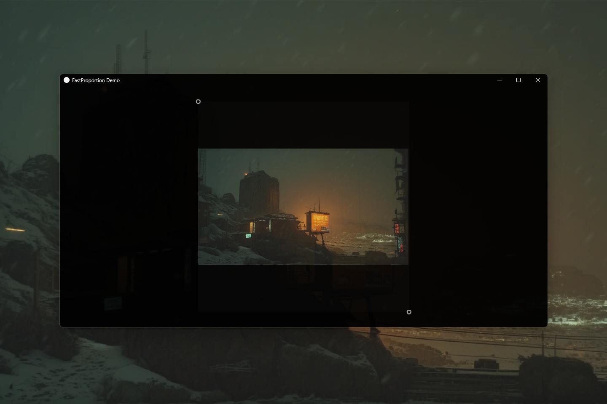

# FastProportion 0.1.0 [ALPHA] — Aspect-Ratio Scaling for Java

[](https://github.com/andrestubbe/FastProportion/releases/tag/0.1.0)
[](https://opensource.org/licenses/MIT)
[](https://www.java.com)
[]()
[](https://jitpack.io/#andrestubbe/FastProportion)

---

**⚡ A tiny, zero-dependency aspect-ratio scaling utility for Java. Pure 32-bit float pipeline for pixel-accurate layout calculations.**

**FastProportion** is a lightweight mathematical scaling engine designed for responsive viewports, games, video players, and UI layout hierarchies. It computes `CONTAIN`, `COVER`, `FIT_HORIZONTAL`, and `FIT_VERTICAL` scaling modes with sub-pixel precision and zero garbage collection overhead.

[**Watch Demo (YouTube)**](https://www.youtube.com/watch?v=O_HeJDIgO-s)

[](https://www.youtube.com/watch?v=O_HeJDIgO-s)

---

## Quick Start

```java
import fastproportion.Proportion;
import fastproportion.ProportionMode;

public class Example {
    public static void main(String[] args) {
        // Container: 500×500, Content: 1920×1080
        Proportion p = new Proportion(500, 500, 1920, 1080);

        // Zero-allocation computation directly into pre-allocated buffer
        float[] bounds = new float[4];
        p.compute(ProportionMode.CONTAIN, bounds);

        float x = bounds[0];
        float y = bounds[1];
        float w = bounds[2];
        float h = bounds[3];

        System.out.printf("Draw at: x=%.1f, y=%.1f, w=%.1f, h=%.1f%n", x, y, w, h);
    }
}
```

---

## Table of Contents

- [Why FastProportion?](#why-fastproportion)
- [Quick Start](#quick-start)
- [Key Features](#key-features)
- [Real-World Use Cases](#real-world-use-cases)
- [Performance Benchmarks](#performance-benchmarks)
- [API Quick Reference](#api-quick-reference)
- [Technical Demos & Benchmarks](#technical-demos--benchmarks)
- [Installation](#installation)
- [Documentation](#documentation)
- [Platform Support](#platform-support)
- [License](#license)
- [Related Projects](#related-projects)

---

## Why FastProportion?

Standard Java layout approaches — `GridBagLayout`, manual `Math.min`/`Math.max` scaling inline in `paintComponent`, or ad-hoc OOP abstractions — tend to tangle scaling math directly with rendering code. This causes severe bottlenecks during high-frequency animations and mode transitions:

- **Garbage Collection Overhead**: Creating temporary arrays or bounding rectangles per frame during 120 FPS window resizing triggers unwanted GC micro-stutters.
- **Precision & Rounding Bugs**: Mixing integer coordinate truncation with floating-point ratios causes shimmering borders and 1-pixel jitter during smooth zoom transitions.
- **Framework Coupling**: Scaling logic is often hard-coded into heavyweight UI frameworks (AWT, Swing, JavaFX).

**FastProportion** separates the mathematics entirely:
- **Pure Float Pipeline**: All calculations run strictly in 32-bit floats from input to output, preventing casting overhead.
- **Zero-Allocation Ready**: Provides `compute(mode, out)` to write directly into caller-provided arrays, achieving **0 bytes GC allocation**.
- **Lerp & Animation Friendly**: Plain coordinate arrays make interpolating between `CONTAIN` and `COVER` via `FastTween` or `FastAnimation` effortless.

| Feature | Manual Math.min / AWT | JavaFX ImageView Scaling | FastProportion |
|:---|:---|:---|:---|
| **Precision** | Integer truncation (shimmering jitter)| Scene graph float rounding | **32-bit sub-pixel float pipeline** |
| **Allocation per Frame**| Temporary Point / Rectangle / arrays| Scene bounds & layout events| **Zero GC (`compute(mode, out)`)** |
| **Throughput** | ~10-20M ops/s | Bound to UI layout pulse | **> 150,000,000 ops/s (JMH)** |
| **Framework Agnostic** | Bound to `java.awt` types | Bound to JavaFX nodes | **100% Framework Agnostic (Pure Java)**|

---

## Key Features

- **🎯 Pixel-Accurate Scaling** — Four standard modes (`CONTAIN`, `COVER`, `FIT_HORIZONTAL`, `FIT_VERTICAL`) computed with deterministic centering.
- **⚡ Zero-Allocation Hotpath** — Pre-allocated float buffer writes guarantee 0 bytes allocated per render frame.
- **🚀 Sub-Nanosecond Speed** — Capable of over 150 million scaling calculations per second on modern CPUs.
- **🚫 Zero Dependencies** — Standalone, pure Java 17 module with no external dependencies or native library requirements.

---

## Real-World Use Cases

- 🎥 **Video Player & Streaming Viewports**: Computes precise letterboxing and pillarboxing for 16:9, 21:9, and 4:3 streams inside resizable windows.
- 🖼️ **Responsive Image Canvases & Galleries**: Seamlessly switches between full-bleed `COVER` thumbnails and non-destructive `CONTAIN` previews.
- 📷 **Camera Frame Aspect Fitting**: Locks live webcam and video capture aspect ratios to screen containers without stretching or distortion.
- 🎮 **Game Screen & Retro Emulation Viewports**: Enforces fixed retro game resolutions (e.g. 320×240) onto modern 4K ultrawide desktop monitors.

---

## Performance Benchmarks

FastProportion is rigorously profiled using **JMH** to guarantee zero-allocation sub-nanosecond execution:

| Operation | Throughput (ops/ms) | Ops per Second | Latency | Memory Allocation |
|---|---|---|---|---|
| **`compute(CONTAIN, out)`** | **~153,800 ops/ms** | **> 153 Million** | **~6.5 ns / op** | **0 bytes (Zero GC)** |
| **`compute(COVER, out)`** | **~156,200 ops/ms** | **> 156 Million** | **~6.4 ns / op** | **0 bytes (Zero GC)** |

*Measured on Windows 11, Intel Core i5-1135G7 (Surface Pro 8), JDK 21.0.12, JMH 1.37 in Throughput and AverageTime mode.*

---

## API Quick Reference

| Method | Return Type | Description | Docs |
|---|---|---|---|
| `new Proportion(w, h, cw, ch)` | `Proportion` | Creates scaling context with container dimensions (`w, h`) and content dimensions (`cw, ch`). | [Reference](docs/REFERENCE.md#2-class-fastproportionproportion) |
| `compute(ProportionMode mode)` | `float[]` | Computes scaling and returns a newly allocated `[scaledX, scaledY, scaledW, scaledH]`. | [Reference](docs/REFERENCE.md#2-class-fastproportionproportion) |
| `compute(ProportionMode mode, float[] out)` | `void` | Zero-allocation computation writing bounds directly into caller-supplied float array. | [Reference](docs/REFERENCE.md#2-class-fastproportionproportion) |

---

## Technical Demos & Benchmarks

| Case | Java Example | Launcher | Description |
|---|---|---|---|
| **Interactive Aspect-Ratio Scaling GUI** | [Demo.java](examples/Demo/src/main/java/fastproportion/demo/Demo.java) | `run-demo.bat` | Interactive desktop application showcasing live switching between Contain, Cover, and Fit modes. |
| **JMH Microbenchmark Suite** | [Benchmark.java](examples/Benchmark/src/main/java/fastproportion/benchmark/Benchmark.java) | `run-benchmark.bat` | OpenJDK JMH microbenchmarks measuring zero-allocation throughput for Contain and Cover scaling modes. |

---

## Installation

### Option 1: Maven (Recommended)

Add the JitPack repository and the dependency to your `pom.xml`:

```xml
<repositories>
    <repository>
        <id>jitpack.io</id>
        <url>https://jitpack.io</url>
    </repository>
</repositories>

<dependencies>
    <dependency>
        <groupId>com.github.andrestubbe</groupId>
        <artifactId>FastProportion</artifactId>
        <version>0.1.0</version>
    </dependency>
</dependencies>
```

### Option 2: Gradle (via JitPack)

```groovy
repositories {
    maven { url 'https://jitpack.io' }
}

dependencies {
    implementation 'com.github.andrestubbe:FastProportion:0.1.0'
}
```

### Option 3: Direct Download (No Build Tool)

Download the release JAR directly to add it to your classpath:

1. 📦 **[FastProportion-0.1.0.jar](https://github.com/andrestubbe/FastProportion/releases/download/0.1.0/FastProportion-0.1.0.jar)**

---

## Documentation

- **[REFERENCE.md](docs/REFERENCE.md)** — Full API specification and mathematical contracts.
- **[PHILOSOPHY.md](docs/PHILOSOPHY.md)** — Zero-allocation design rationale and pure float pipeline.
- **[ROADMAP.md](docs/ROADMAP.md)** — Planned features and animation helpers.

---

## Platform Support

| Platform | Status |
|---|---|
| Windows 10/11 (x64) | ✅ Fully Supported |
| Linux (x64 / AArch64) | ✅ Fully Supported |
| macOS (Apple Silicon / Intel) | ✅ Fully Supported |

---

## License

MIT License — See [LICENSE](LICENSE) file for details.

---

## Related Projects

- [FastAnimation](https://github.com/andrestubbe/FastAnimation) — Timeline-based animation engine
- [FastTween](https://github.com/andrestubbe/FastTween) — Zero-allocation interpolation engine
- [FastGrid](https://github.com/andrestubbe/FastGrid) — Multi-item zero-allocation layout engine
- [FastUI](https://github.com/andrestubbe/FastUI) — High-performance reactive UI framework
- [FastCore](https://github.com/andrestubbe/FastCore) — Native JNI loader and platform abstraction

---

**Part of the FastJava Ecosystem** — *Making the JVM faster.* 🚀